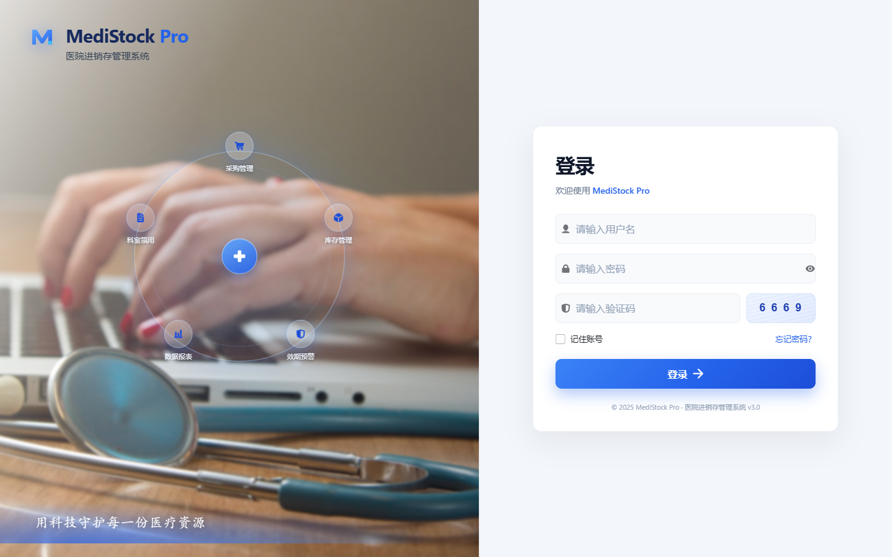
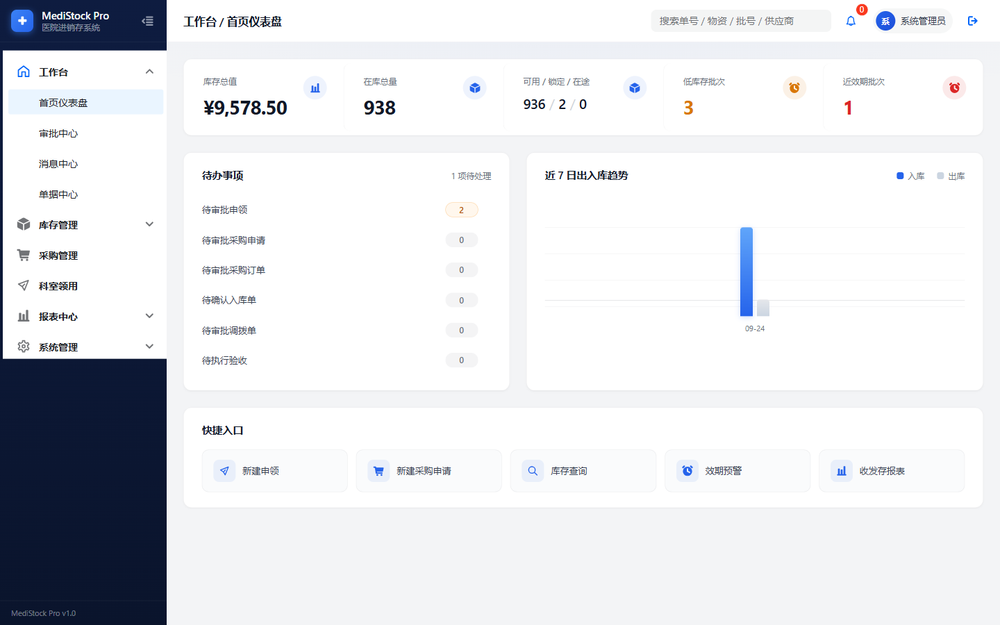

# MediStock-Pro

> 用科技守护每一份医疗资源

一套面向医院 / 医疗机构的**进销存（采购 - 库存 - 领用 - 核算）一体化管理系统**，覆盖物资主数据、采购全链路、科室申领、库存作业（入库 / 出库 / 调拨 / 盘点 / 退库 / 报废）、效期预警、报表分析与精细化权限控制。


---

## 在线预览 / 演示

| 项 | 值 |
| --- | --- |
| 演示地址 | `http://localhost:5173`（本地启动） |
| 管理员账号 | `admin` / `admin123` |





---

## 功能特性

### 工作台
- **首页仪表盘**：库存总值、在库总量、可用 / 锁定 / 在途、低库存批次、近效期批次实时指标
- **待办事项**：待审批申领 / 采购申请 / 采购订单 / 调拨单、待确认入库、待执行验收统一聚合，一键直达审批中心
- **审批中心**：五类业务单据（申领、采购申请、采购订单、调拨、报废）统一待办与审批留痕
- **消息中心 / 单据中心 / 全局搜索**：业务消息通知、单据统一检索、单号 / 物资 / 批号 / 供应商全局搜索

### 库存管理
- **库存总览**：库房树 + 物资分类树双侧栏联动筛选，库存明细按分类（含子分类）聚合
- **库存查询**：批次级库存（可用 / 锁定 / 在途）、批次冻结 / 解冻、库存台账流水
- **入库管理**：入库单全流程（草稿 → 确认入库），自动生成批次与库存流水
- **出库管理**：申领驱动拣货（FEFO 先效期先出推荐批次）、复核出库、科室签收、红冲冲销
- **库存调拨**：调拨单提交 → 审批 → 发运 → 收货在途闭环
- **盘点管理**：盘点计划 → 库存快照 → 差异录入 → 确认调账
- **退库 / 报废**：退库入库、报废审批后库存核销
- **效期预警 / 预警中心**：90 天近效期、已过期批次按到期日分级提醒

### 采购管理
- 采购申请 → 审批 → 转采购订单 → 订单审批 → 到货登记 → 验收 → 入库全链路
- 采购协议（生效 / 终止）、验收异常登记与整改闭环
- 供应商档案、资质管理、供应商物资报价与调价

### 科室申领
- 科室以组织树方式选择，申领单提交 → 审批改量 → 锁定库存 → 拣货 → 出库签收
- 紧急 / 普通优先级，申领与已发数量全程跟踪

### 报表中心
- 收发存汇总报表、供应商分析报表

### 系统管理
- **RBAC 权限**：75 个功能权限点，按菜单模块 15 组配置；按钮级 `v-permission` 控制 + 路由守卫 + 菜单过滤
- **数据权限**：全部数据 / 按仓库 / 本机构三级数据范围，行级仓库隔离
- 组织机构树（集团 / 医院 / 院区 / 科室）、仓库与库位、物资主数据（分类树、包装换算、批号效期属性、高值耗材 / UDI 标记）
- 用户角色、操作日志（审计）、系统参数版本与回滚、数据字典、接口监控
- CSV 物资导入 / 导出（异步任务记录）

### 工程特性
- 后端 Sa-Token 鉴权、乐观锁并发控制、幂等键防重复提交
- Flyway 数据库版本管理，启动自动建表 + 初始化演示数据
- 前端 TypeScript 全量类型检查，Vite 开发代理，同时提供 Electron 桌面端壳

---

## 技术栈

| 层 | 技术 |
| --- | --- |
| 前端 | Vue 3.5 + TypeScript 5.6 + Vite 5 + Pinia + Vue Router 4 |
| UI | Semi Design（@kousum/semi-ui-vue）+ ECharts 5 |
| 桌面端 | Electron |
| 后端 | Spring Boot 3.3.5 + Java 17 |
| ORM | MyBatis-Plus 3.5.9 |
| 鉴权 | Sa-Token 1.44 |
| 数据库 | MySQL 8.0 + Flyway（版本迁移） |
| 文档 | Knife4j / OpenAPI 3（Swagger） |
| 构建 | Maven + npm/pnpm |

---

## 项目结构

```
MediStockPro/
├── MediStockPro-web/       # 前端 (Vue 3 + Vite)
│   └── src/
│       ├── api/            # 接口封装
│       ├── constants/      # 权限点目录 / 路由权限映射
│       ├── directives/     # v-permission 按钮级权限指令
│       ├── layout/         # 主框架 (侧栏/顶栏)
│       ├── router/         # 路由 + 权限守卫
│       ├── stores/         # Pinia (用户/权限/数据范围)
│       └── views/          # 业务页面 (stock/purchase/issue/report/system/home/master)
├── MediStockPro-server/    # 后端 (Spring Boot)
│   └── src/main/java/com/medistock/pro/
│       ├── common/         # 统一响应/异常/分页
│       ├── config/         # 配置 + DataInitializer 演示数据
│       └── modules/        # 业务域: master/inventory/purchase/alert/dashboard/system ...
├── MediStockPro-desktop/   # Electron 桌面端
└── docs/screenshots/       # 项目截图
```

---

## 快速开始

### 环境要求

- JDK 17+
- Node.js 18+（推荐 pnpm）
- MySQL 8.0+
- Maven 3.8+

### 1. 初始化数据库

```sql
CREATE DATABASE medistock_pro DEFAULT CHARACTER SET utf8mb4 COLLATE utf8mb4_unicode_ci;
```

数据库表结构与演示数据由 Flyway 在后端首次启动时自动执行（`db/migration/V1__init.sql` 等），无需手动导入。

### 2. 启动后端

```bash
cd MediStockPro-server
# 按需修改 src/main/resources/application.yml 中的数据库账号密码（支持环境变量 MYSQL_USERNAME / MYSQL_PASSWORD / JWT_SECRET_KEY）
mvn spring-boot:run
```

后端运行于 `http://localhost:8081`，接口文档：`http://localhost:8081/doc.html`

### 3. 启动前端

```bash
cd MediStockPro-web
npm install
npm run dev
```

前端运行于 `http://localhost:5173`，已配置 `/api` 代理到 8081。

### 4. 桌面端（可选）

```bash
cd MediStockPro-desktop
npm install
npm start
```

---

## 默认账号

| 角色 | 账号 | 密码 | 说明 |
| --- | --- | --- | --- |
| 系统管理员 | `admin` | `admin123` | 全部权限 |
| 药房角色 | `pharma` | `123456` | 零业务权限，用于验证权限隔离 |

> 演示数据包含物资、供应商、库存批次与各类单据，可直接体验完整流程。

---

## 接口文档

启动后端后访问 Knife4j：**http://localhost:8081/doc.html**

---

## 许可证

本项目采用 **「学习免费 · 商业授权」** 双轨许可，详见 [LICENSE](LICENSE)：

- ✅ **个人学习、研究、技术评估、非商业的教学与演示**：可免费使用、阅读与修改源码，但需保留版权声明；
- ⚠️ **任何商业用途均需事先取得书面授权**，包括但不限于：
  - 在营利性 / 经营性机构（含医院、连锁药房、医药商业公司）的生产环境部署使用；
  - 基于本项目二次开发后的产品销售、交付或提供 SaaS / 云服务；
  - 将本项目整体或部分用于商业项目交付。

商业授权 / 合作：**bingfeng_li@163.com**（微信：`byoungfeng`）。未经授权的商业使用，作者保留追究法律责任的权利。

---

## 免责声明

本项目为企业级进销存系统的**学习与参考实现**，虽包含较完整的业务与权限模型，但不保证完全符合任何地区的医疗监管（如 GSP / 医疗器械经营管理）要求。用于真实医疗业务前，请自行完成合规评估与专业验收。
